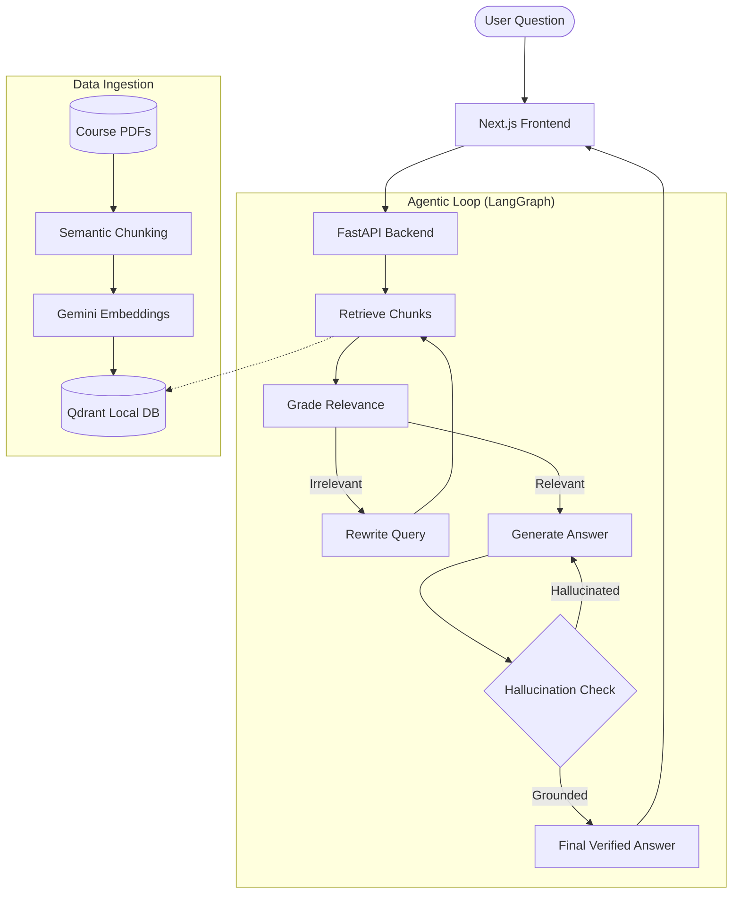

# SupportVector Training Coach 🤖📚

An **Agentic RAG (Retrieval-Augmented Generation)** chatbot designed to act as a specialized technical tutor for the "Large Language Models" course. Built with **LangGraph**, **Gemini 2.0**, and **Qdrant**.

## 🏗 Architecture Diagram



## 🚀 Key Features

- **Zero-Hallucination Policy**: Strictly grounded in course PDFs (Weeks 1-4).
- **Agent Reasoning Trace**: High-transparency UI showing the agent's internal "thoughts" and fact-checking steps.
- **Self-Correction**: Automated "Graders" evaluate retrieval quality and hallucination risks.
- **Verified Citations**: Clickable source references with file names and page numbers.

## 🛠 Tech Stack

- **LLM**: Google Gemini 2.0 Flash
- **Orchestration**: LangGraph / LangChain
- **Vector DB**: Qdrant (Running in local path mode)
- **Frontend**: Next.js 15, Tailwind CSS, Framer Motion
- **Backend**: Python, FastAPI

## 📦 Installation & Setup

### 1. Clone and Install
```bash
git clone https://github.com/SangeethaKumari/SupportvectorTrainingCoach.git
cd SupportvectorTrainingCoach

# Setup Backend
pip install -r backend/requirements.txt

# Setup Frontend
cd frontend
npm install
cd ..
```

### 2. Environment Configuration
1. Copy the example environment file:
```bash
cp .env.example .env
```
2. Open `.env` and update your Gemini API key:
```env
GOOGLE_API_KEY=your_gemini_api_key_here
COLLECTION_NAME=llm_course_material
```

### 3. Data Ingestion
To populate the chatbot with knowledge:
1. Place your course PDF files inside the `data/` folder.
2. Run the ingestion script:
```bash
python -m backend.ingestion
```
*Note: This will create a `qdrant_db/` folder locally which stores the processed embeddings.*

### 4. Running the Application
**Backend:**
```bash
export PYTHONPATH=$PYTHONPATH:.
python -m backend.main
```

**Frontend:**
```bash
cd frontend
npm run dev
```

## 🧪 Testing the Brain
You can test the agent logic directly in the terminal:
```bash
python test_agent.py
```


graph.py

Here is the step-by-step technical flow:

1. The Entry Point: 

retrieve
The graph begins by converting the user's natural language question into a vector and searching the Qdrant database. It retrieves the top technical chunks from your course PDFs.

Next Node: 

grade_documents
2. The Quality Control: 

grade_documents
This is where the "Agentic" part starts. A specialized Gemini 2.0 grader examines every retrieved chunk.

Logic: It looks for a semantic match. If you ask for "Week 5" and the chunk is about "Vectors in Week 1," the grader marks it as irrelevant.
Decision (Conditional Edge):
If relevant chunks exist: Proceed to 

generate
.
If no relevant chunks exist: Proceed to 

transform_query
.
3. The Recovery Step: 

transform_query
If the initial search failed, the agent doesn't give up. It asks Gemini to rewrite the user's query for better retrieval (e.g., "What is in Week 5?" might become "SupportVector course curriculum week 5 syllabus").

Next Node: It loops back to 

retrieve
 to try the search again with the new query.
4. The Production: 

generate
The agent takes the verified chunks and synthesizes a technical answer. It is strictly instructed to use only the provided context and to provide citations.

Next Node: 

grade_generation_v_documents_and_question
 (The Double-Check).
5. The "Zero-Hallucination" Gate
This is a complex conditional edge that performs two separate audits on the answer:

Hallucination Audit: It compares the answer to the source facts. If Gemini detects a fact not present in the sources, it sends the agent back to 

generate
 to "re-draft" the answer.
Usefulness Audit: It checks if the answer actually satisfies the user's question. If the answer is general but the question was specific, it sends the agent back to 

transform_query
 to find better data.
Exit: Only when the answer is both grounded and useful does the graph reach the END.