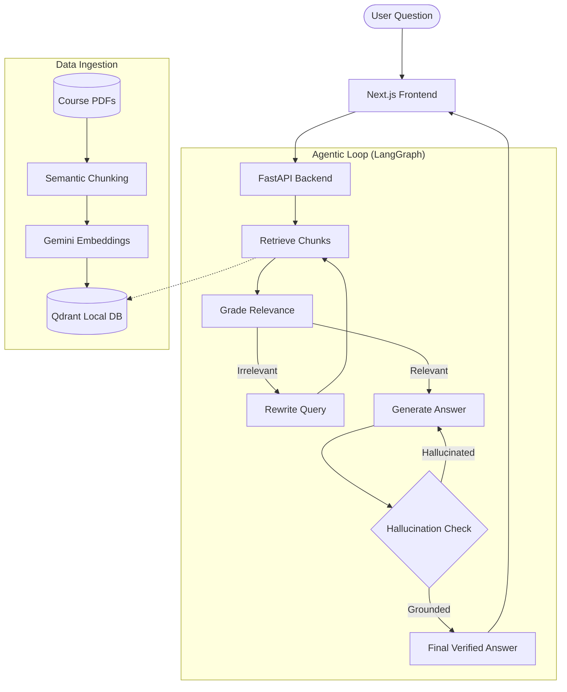

# SupportVector Training Coach 🤖📚

### An **Agentic RAG (Retrieval-Augmented Generation)** chatbot designed to act as a specialized technical tutor for the "Large Language Models & AI Agents" course. Built with **LangGraph**, **Gemini 3.0**, and **Qdrant**.

## 🏗 Architecture Diagram


```mermaid
graph TD
    User([User Question]) --> NextJS[Next.js Frontend]
    NextJS --> FastAPI[FastAPI Backend]
    
    subgraph "Agentic Loop (LangGraph)"
        FastAPI --> Retrieve[Retrieve Chunks]
        Retrieve --> Grade[Grade Relevance]
        
        Grade -- "Irrelevant" --> Rewrite[Rewrite Query]
        Rewrite --> Retrieve
        
        Grade -- "Relevant" --> Generate[Generate Answer]
        
        Generate --> CheckHallucination{Hallucination Check}
        
        CheckHallucination -- "Hallucinated" --> Generate
        CheckHallucination -- "Grounded" --> FinalAnswer[Final Verified Answer]
    end
    
    FinalAnswer --> NextJS
    
    subgraph "Data Ingestion"
        PDFs[(Course PDFs)] --> Chunking[Semantic Chunking]
        Chunking --> Embed[Gemini Embeddings]
        Embed --> Qdrant[(Qdrant Local DB)]
    end
    
    Retrieve -.-> Qdrant
```

## 🚀 Key Features

- **Zero-Hallucination Policy**: Strictly grounded in course PDFs (Weeks 1-4).
- **Agent Reasoning Trace**: High-transparency UI showing the agent's internal "thoughts" and fact-checking steps.
- **Self-Correction**: Automated "Graders" evaluate retrieval quality and hallucination risks.
- **Verified Citations**: Clickable source references with file names and page numbers.

## 🛠 Tech Stack

- **LLM**: Google Gemini 3.0 Flash (preview)
- **Orchestration**: LangGraph / LangChain
- **Vector DB**: Qdrant (Running in local path mode)
- **Frontend**: Next.js 15, Tailwind CSS, Framer Motion
- **Backend**: Python, FastAPI

## 📦 Installation & Setup

### 1. Clone and Install
```bash
git clone https://github.com/SangeethaKumari/SupportvectorTrainingCoach.git
cd SupportvectorTrainingCoach

# Setup Backend, if uv us is not set up
pip install -r backend/requirements.txt

## if uv is set up
uv sync          # reads pyproject.toml → creates uv.lock →installs
uv run backend/graph.py   # runs the script with the managed venv

# Setup Frontend
cd frontend
npm install
cd ..
```
### If uv is not set up
### 2. Environment Configuration
1. Copy the example environment file:
```bash
cp .env.example .env
```
2. Open `.env` and update your Gemini API key:
```env
GOOGLE_API_KEY=your_gemini_api_key_here
COLLECTION_NAME=llm_course_material
```

### 3. Data Ingestion
To populate the chatbot with knowledge:
1. Place your course PDF files inside the `data/` folder.
2. Run the ingestion script:
```bash
python -m backend.ingestion
```
*Note: This will create a `qdrant_db/` folder locally which stores the processed embeddings.*

### 4. Running the Application
**Backend:**
```bash
export PYTHONPATH=$PYTHONPATH:.
python -m backend.main
```

**Frontend:**
```bash
cd frontend
npm run dev
```

## 🧪 Testing the Brain
You can test the agent logic directly in the terminal:
```bash
python test_agent.py
```


