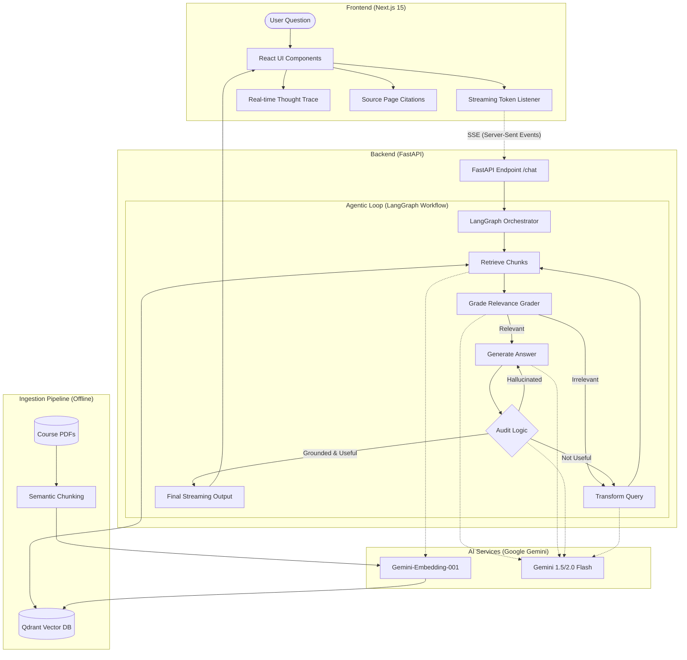

# SupportVector Training Coach: Architecture Overview 🛡️📚

The **SupportVector Training Coach** is an Agentic RAG (Retrieval-Augmented Generation) system specifically engineered to serve as a high-fidelity technical tutor for the "Large Language Models & AI Agents" course.

---

## 🏗 System Architecture Diagram



---

## 🛠 Technology Stack

### **Frontend**
*   **Framework**: Next.js 15 (App Router, TypeScript)
*   **Styling**: Tailwind CSS for high-fidelity technical UI.
*   **Animations**: Framer Motion for smooth state transitions and "thinking" indicators.
*   **Icons**: Lucide React for clean, minimalist iconography.

### **Backend**
*   **Framework**: FastAPI (Python)
*   **Package Manager**: `uv` (modern, ultra-fast Python dependency management).
*   **Streaming**: Server-Sent Events (SSE) to deliver real-time agent "thoughts" and generated tokens.

### **Intelligence & Orchestration**
*   **LLM**: **Google Gemini 3.0 Flash** (used for reasoning, grading, and generation).
*   **Orchestration**: **LangGraph** (StateGraph) for building robust, cyclic agentic workflows.
*   **Embeddings**: `models/gemini-embedding-001` for semantic representation.
*   **Vector DB**: **Qdrant** (Running in local path mode `./qdrant_db`).

---

## 🧠 The "Agentic Loop" Core Logic

Unlike standard RAG, the "Agentic" approach ensures high reliability and zero-hallucination through several self-correction nodes:

1.  **Semantic Retrieval**: Queries are vectorized and matched against high-dimensional manifold space in Qdrant.
2.  **Relevance Grader**: A binary classifier that filters out noise. If the retrieved context is irrelevant (e.g., asking about Week 10 when only Weeks 1–4 are loaded), the agent detects this.
3.  **Query Transformation**: If retrieval fails, the agent uses self-reflection to rewrite the user query (e.g., "What is Week 5?" becomes "SupportVector course curriculum week 5 syllabus") and retries.
4.  **Draft Generation**: Synthesizes a response using **strict grounding** instructions.
5.  **Multi-Stage Audit**:
    *   **Hallucination Check**: Compares the LLM response against the retrieved source facts.
    *   **Usefulness Check**: Verifies if the answer actually satisfies the specific user constraint.

---

## 📂 Project Structure

```text
.
├── backend/
│   ├── main.py         # FastAPI Entry Point (Streaming logic)
│   ├── graph.py        # LangGraph Multi-Node Workflow
│   ├── ingestion.py    # PDF to Vector conversion
│   └── requirements.py # Dependency list
├── frontend/
│   ├── src/app/        # Next.js Pages & Layout
│   ├── src/components/ # Modular React Components
│   └── tailwind.config.ts
├── data/               # Course PDF source files
├── qdrant_db/          # Persistent local vector storage
└── .env                # API Keys and configuration
```
